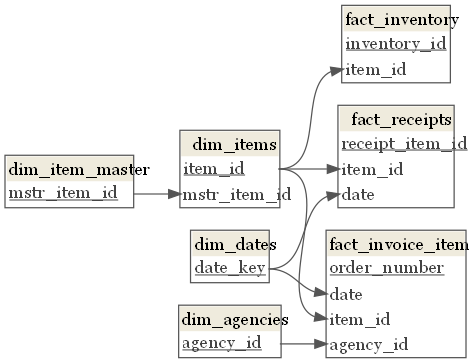

# data-io-2021-velocity
Challenge, Code, Documentation for the velocity project in support of the Data I/O Hackathon

# Challenge Summary

## Business Overview 

Our Mission: To end hunger one nourishing meal at a time while co-creating communities where everyone thrives. 

Our Vision: A hunger-free and healthier community. 

History: Chartered in 1980, Mid-Ohio Foodbank has continued to evolve, improve, and innovate strategies in hunger relief for 40 years. We are the largest hunger-relief organization in central and eastern Ohio and one of the largest food banks in the county. We are a proud member of Feeding America, the largest national domestic hunger relief charity and are represented by the Ohio Association of Foodbanks. 

Our Work: As an organization, we are deeply committed to ending hunger in our community. We understand food as health and value the critical role that nutrition plays in an individual’s overall well-being. As a result, we work each day with our network of roughly 680 community partners across our 20-county service area to enhance the quality of life for children, adults, and seniors who do not have enough to eat by providing them with the quality and quantity of food they need to create balanced, nourishing meals. Our partners include food pantries, produce markets, soup kitchens, emergency shelters, and senior and after school care programs. During our last fiscal year, we distributed 67 million pounds of food and groceries, of which more than 60% consisted of fresh, perishable foods. Together, in collaboration with our partner network, we reached more than 500,000 of our hungry neighbors. 

## Background 

Food banks operate as the distribution centers for their networks of food pantries. Food is ordered by agencies and shipped out of our facility, or picked up. That food is then distributed to our hungry neighbors by community organizations including food pantries, soup kitchens, and homeless shelters among others. For food to enter the facility it can be purchased from farms and vendors or be donated by individuals, retailers, and manufacturers. 

When food comes to the facility it is received at our receiving dock and decisions are made about how the shipment will be detailed. In general, shipments are detailed so that each assortment of items receives a unique item number (e.g. a shipment with 12 pallets of green peppers may be assigned VAP9081).  

Item number assignment ensures traceability of items back to their date of receipt, donor/vendor, and movement throughout the facility. The unique item numbers also support important business rules such as “First in First Out” (FIFO) policy to ensure we distribute products we received earlier rather than after later receipts of the same item. This level of traceability also enables us to document inspection results upon delivery such as temperature and other quality checks of the shipping container.  There are numerous variations of items.  For example, green beans can be in a 14 oz can, in a 64 oz can, no salt added, or frozen.  Given that there are unique item numbers for each product/shipment and it comes in many forms, how can we report on green beans as whole?   

## Challenge – Velocity Report  

Using the data set, identify a solution for reporting on the velocity of the items from a commodity level.  Velocity is the speed in which the products move through receiving, storage in the warehouse, and out the door (e.g. 700 lbs per week, or 14 days per 1000 lbs, or... something else!).  We’ve identified the “Top 100” theoretical items to include in the tool.  

These items may not be the most distributed throughout the food bank’s history, but instead represent a theoretical inventory model we would like to shift our food sourcing and distribution policies towards. The specific items in our theoretical inventory model will change over time to reflect shifts in product preferences and distribution models. However, developing a methodology to understand the velocity of a given theoretical item is a durable innovation that will remain a part of MOFC’s operations process for years to come. 

 The first step in this effort in developing a method to understand how popular any given items are is linking similar item numbers together. E.g. VAP9081 and ZZ549 both represent “Green Peppers”. Link them together with dim_items.mstr_item_id -> dim_item_master.mstr_item_id. At MOFC, we have been piloting this process during our receiving process for produce item numbers, and have linked select other item numbers to their theoretical items. While we may desire for this process to be more automated or streamlined, that is not the focus of this challenge. 

In FY 2021, we received less than 6000 item numbers, and when we look at produce items we can see we have item number – to – theoretical item linking for 99.6% of those items. Instead of focusing on how to link the item numbers together, our organization is prepared to accomplish this manually. Instead, we want your help exploring the following topics as related to velocity reporting. The velocity tool should provide answers to different questions for each department below: 

### Personas

*Operations Executive*	- C-Suite individual who is responsible for the operating policies of the organization. Is responsible for managing processes controlling food receipt, inventory, distribution, and associated clerical processes.

*Food Sourcing Manager* - Manager who is able to source product for distribution. Optimizes choices to secure food donations and minimize costs while also securing a variety of desirable products at a fair price.

### User Stories

### Requirements & Acceptance Criteria

## Data Summary 

## Data Documentation

Additional Schemas (.png & .pdf) are located in the documentation folder.

Data Schema - Keys Only

## Data

Data is located in the data folder, and provided in .csv format
